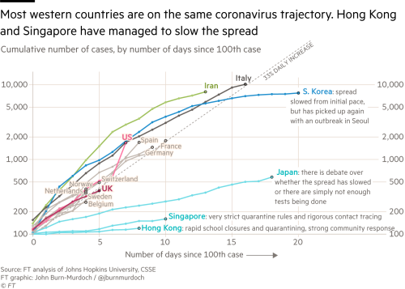
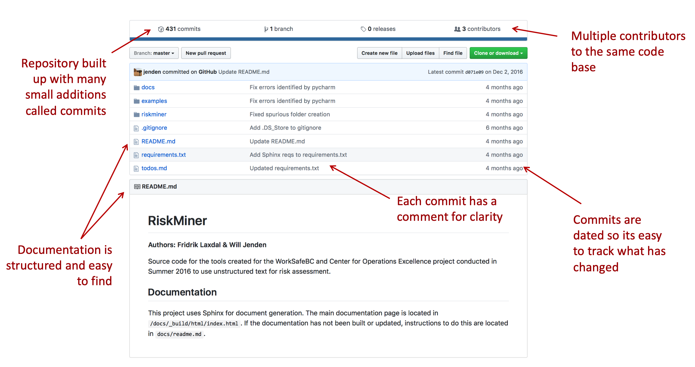
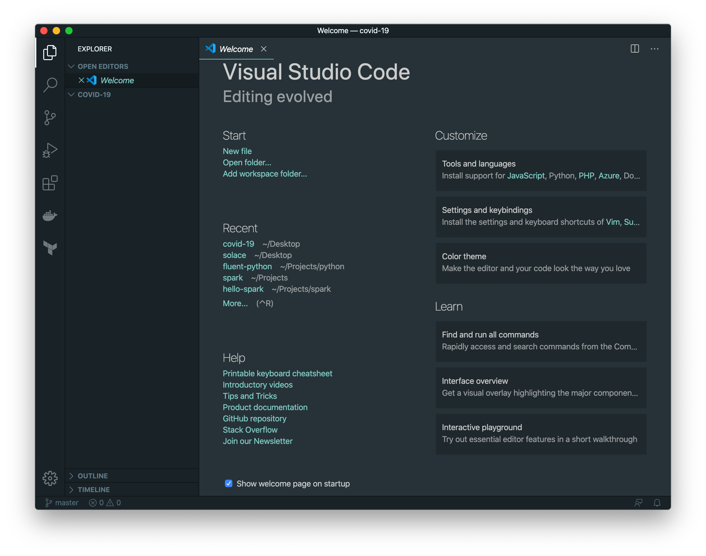

# Using Git for Analysis Projects

We're going to create a plot of the Covid-19 cases around the world using publically available data compiled by [Johns Hopkins](https://github.com/CSSEGISandData). We'll write a script we can use to update the data, create a visualizations and then try contributing to someone else's code with a merge request.

[](https://www.ft.com/content/ff3affea-63c7-11ea-b3f3-fe4680ea68b5)


### But first, what is Git?

Git is a distributed version control system. It's software to help track and manage source code, which means it works with any kind of text files. It was developed by [Linus Torvalds](https://en.wikipedia.org/wiki/Linus_Torvalds) (the creator of Linux) to manage the Linux kernel. The software is open source and freely distributed.

* Keep a canonical working version
* Easily restore or reset changes that break your code
* Separate valid code from new analysis or "features" 
* Collaborate with others on the same files

But Git is not a panacea and there are many ways to tie yourself up in knots. However, it can reinforce good habits and help save you from yourself. Plus, if you want to work in software, basic familiarity is a job requirement.


### Git vs. GitHub

**Git** is the tool you run on your computer to manage local repositories. **GitHub** is a service that hosts remote git repositories (like this one) so you can share your code and collaborate with others. Git can be used locally but GitHub lets users keep a secure, canonical copy in the cloud and give others access as needed. 

GitHub repositories can be **public** (like [Git itself](https://github.com/git/git), [Python](https://github.com/python/cpython), various [BC Government Projects](https://github.com/bcgov)) or **private** (users include the [US Dept of Defense](https://github.com/deptofdefense), [Microsoft](https://github.com/Microsoft), and [UBC](https://github.com/ubc-library)). While there are other services (I like GitLab), GitHub is the defactor standard in the industry so we're going to use it for this tutorial.




### Create a Repository

A repository starts as just a folder on your computer. Then we'll use git to initialize a repository and add files. 


> We're going to use the terminal to do this, so prepare yourself. I'll use `$` to denote the bash prompt (although yours may be `>`  or `%` or something else entirely) and `# <a comment>` to add additional context. The output  of commands will not have any symbol.


```bash
$ # print the current directory (i.e. folder) 
$ pwd  
/Users/willjenden/Projects
$ # create a new directory
$ mkdir covid-19
$ # change directories into the new directory. 
$ cd covid-19
$ pwd
/Users/willjenden/Projects/covid-19
$ # list the contents of the directory
$ ls
```


We know have a new directory with nothing in it. It's not even a git repository yet. In order to make it a git repository we need to run `git init` from the directory. You can do this at any time in any folder (that's not a child of another git repository) not just an empty one.

```bash
$ git init
Initialized empty Git repository in /Users/willjenden/Projects/covid-19/.git/
$ ls
```


And we have a repository. It's empty, but now it's an empty git repository. If you execute `ls -a` (list all) then should see a `.git` folder. This is where git keeps track of your repository. As a general rule of thumb, you don't need to go in here so just let git do it's thing.


> Along with `.git`, you should have seen two other entires: `.` and `..`.  `.` is a reference to the current directory and `..` is a reference to the parent directory. You can try navigating around with different combinations of `.` and `..` like `cd ..` will bring you to `covid-19` and `cd covid-19/../` will take you on trip into the covid directory and then back out.


### Add some files

Let's create a README in our repository. A README is a text document (usually in Markdown) that provides new users (and sometimes, yourself in six months) an introduction to the project. It should explain the purpose of the project, how to set up the development environment and how to run links to other useful information, either in the repository or externally.

I'm not going to make you write files from command line, so let's open an editor in this folder. I'm using Visual Studio Code so I can run `code .` to open the current directory (`.`) in VSCode.

```bash
$ code .
```


 You should see something like this:



You'll see a folder on the left side, and not much else. Go back to your terminal and type `touch README.md`. You should now see a file called *README.md* in the left panel. Open it up and let's start our file.

```markdown
# COVID-19 Confirmed Cases Visualization

This project recreates the COVID-19 growth trajectory plots using publically available data
compiled by [Johns Hopkins](https://github.com/CSSEGISandData).
```


>  By the way, this syntax (and the *\*.md* file extension) is markdown. It's lightweight and meant to be readable as plain text or quickly formatted and styled for display on the Web. I highly recommend getting comfortable with [GitHub flavored markdown](https://guides.github.com/features/mastering-markdown/) for writing documents in version control.


Now we're finally going to start using Git. From the terminal let's look at our changes, add the file to the staging area and then commit it to the repository. 

```bash
$ git status
On branch master

No commits yet

Untracked files:
  (use "git add <file>..." to include in what will be committed)
        README.md

nothing added to commit but untracked files present (use "git add" to track)
```


We use the git status to tell us what's going in the repo and often gives us useful hints about what we should do next. The important take away here is that we have "untracked" files. Untracked files are files that existing in the git repository (the top level directory or any child directory) but are not being managed by Git. We can tell git to start tracking a file with the `git add <file>` command.

```bash
$ git add README.md
$ git status
On branch master

No commits yet

Changes to be committed:
  (use "git rm --cached <file>..." to unstage)
        new file:   README.md
```


The *README.md* file is now in the staging area for our repository with a note that says it's a new file. For git to create an indelible copy of the file with it's current contents, we need to create a "commit". A commit is the immutable, atomic unit of git because the state of the repository is built up from a graph of related commits. 

```bash
$ git commit -m "Add README"
[master (root-commit) 116767f] Add README
 1 file changed, 3 insertions(+)
 create mode 100644 README.md
```


Now our repository has a single commit which contains the small README we just wrote, our name as author and a helpful message to remind us why we made the commit. 


Commits are identified by a hash which is cryptographically determined by the contents of the commit. If any of the contents change, even by a single bit, we would get a different hash. This 40-digit alpha-numeric number is often abbreviated to the first 8 digits. We can check the history of commits and see the full log with the `git log` comand.

```bash
$ git log
commit 116767f52e0caddd8505b2f8becf247988ad076e (HEAD -> master)
Author: jenden <some-email-address@gmail.com>
Date:   Wed Apr 29 22:06:27 2020 -0700

    Add README
```


### Add some more files!

Let's make this repository do something useful. I've created a script to pull the daily COVID-19 data curated by Johns Hopkins. Create a new directory called `scripts` in your repository and then add the [`update_data.py`](scripts/update_data.py) script to the directory. 

In order to run this script we'll need to tell our future selves (and other users) how to set up a python environment and how to use the script to update data. A README is the obvious place to document this. 


> A quick aside. Documentation is hard to get right. If we carefully document every bit of our script (or comment it for that matter), it's very easy for it to get out of sync with what the code actually does. Our goal is to strike a balance to let people know what to do but not to create technical debt for ourselves in the future with stacks of documentation we need to update every time we modify the code. And, like many things, there are diminishing returns to our efforts. A little, well-maintained documentation goes a long way.


Add the following sections to the README file.

```markdown
### Environment

Create your python virtual environment of choice. When that environment is active, 
run the following command:

​```bash
pip install -r requirements.txt
​```

### Data

The Center for Systems Science and Engineering at Johns Hopkins maintains daily summary 
of Coronavirus data around the world in a [GitHub repository](https://github.com/CSSEGISandData/COVID-19/tree/master/csse_covid_19_data/csse_covid_19_daily_reports). 
Run the `update_data.py`script to update the data. The command below will download the
data from Jan 22 to April 25 and save it in the `data/` folder of this directory.

​```bash
python scripts/update_data.py --start 2020-01-22 --end 2020-04-25 data/
​```
```


Now create the requirements.txt file with the following contents:

```
# requirements.txt
requests==2.23
pandas==1.0
```


That's all done. Let's check the status of our git repository:

```bash
$ git status
On branch master
Changes not staged for commit:
  (use "git add <file>..." to update what will be committed)
  (use "git restore <file>..." to discard changes in working directory)
        modified:   README.md

Untracked files:
  (use "git add <file>..." to include in what will be committed)
        requirements.txt
        scripts/

no changes added to commit (use "git add" and/or "git commit -a")
```


This is more complicated than before. We have untracked files *requirements.txt* and *scripts/* and modified file *README.md*. Now is a good time to talk about the life cycle of git files. All files we create start out as "untracked" in our working directory. When we use `git add` we checkpoint the current contents of the file in the "staging area". Then when we are happy with the changes we've staged, we can create a permanent record of those changes by creating a commit.


In this commit, we have changes to the README file that git is tracking (because it was previously committed) and new files we have just created. Let's add them all to the staging area and commit them. We can tell git to add the files by listing them one by one like `git add requirements.txt scripts/update_data.py` or we can tell git to add all files in the current directory using the `.` shorthand.  Now run git commit like before.


```bash
$ git add .
$ git commit -m "Add data update script and environment requirements"
[master 4bc6f91] Add data update script and environment requirements
 3 files changed, 111 insertions(+)
 create mode 100644 requirements.txt
 create mode 100644 scripts/update_data.py
```


You can use `git log` to assure yourself the commit worked. You can also check `git status` and see that you have "nothing to commit" because the working directory is "clean".


### Get some data

Now let's create a virtual environment, install our requirements and run our `update_data.py` script so we can start to visualize the data!

```bash
$ # create a python virtualenv, activate it and install requirements
$ virtualenv env
$ source env/bin/activate
$ pip install -r requirements.txt
```


> Alternatively, you could create a conda environment. I generally prefere these environments, but they don't create a folder we need to ignore so it's not as useful for this demonstration. Install a conda environment using python 3.8 and the dependencies in requirements.txt like this.
>
> ```bash
> $ conda create --name covid-19 python=3.8 --file requirements.txt
> $ conda activate covid-19
> ```
>
> Once you activate the environment, your shell should contain the active environment in the prompt (although it probably won't look quite like this)
>
> ```bash
> (covid-19) $
> ```


Hopefully that all went smoothly. If the script failed, check that you created and specified the right data directory beforehand and that the URL for the CSV files hasn't changed. 

We just created a bunch of new files in our repository. Check the status and you can see two new directories, *env* and *data*.

```bash
$ git status
On branch master
Untracked files:
  (use "git add <file>..." to include in what will be committed)
        data/
        env/

nothing added to commit but untracked files present (use "git add" to track)
```


Unlike previous files, the *env* directory is specific to our local machine and shouldn't be contributed to the repository. The contents of *data* doesn't need to be version controlled because it can be downloaded from the source at any point in time. In general, it's good practice to keep data out of version control and separate from the code to process it. Luckily it's easy to tell git to ignore files with a [`.gitignore`](https://help.github.com/en/github/using-git/ignoring-files) file. Create a file in the root directory and put in the following contents:

```
# .gitignore
.vscode
env/
data/
```


Now try checking the status of the repository again. You can use`ls` to confirm that the directories still exist but that git is ignoring them. Now commit the contents of the *.gitignore* file and let's continue.

```bash
$ git status
On branch master
Untracked files:
  (use "git add <file>..." to include in what will be committed)
        .gitignore

nothing added to commit but untracked files present (use "git add" to track)
$ ls
README.md
data
env
requirements.txt
scripts
$ git add .gitignore
$ git commit -m "Create gitignore"
```


### Create a visualization!


## Appendix

### Repository Structure

We'll use the [Cookiecutter Data Science](http://drivendata.github.io/cookiecutter-data-science/) layout as a starting point. The repository structure is meant to encourage good that make your work analysis repeatable, easy to follow, don't modify the original data and keeps sensitive data out of version control. 


* **README** - every repository should have a README. It provides new users (and sometimes, yourself in six months) an introduction to the project. It should explain the purpose of the project, how to set up the development environment and how to run links to other useful information, either in the repository or externally.
* **data** directory - this repository contains local copies of data when necessary. It *should not* be kept in version control. This is achieved with a [`.gitignore`](https://help.github.com/en/github/using-git/ignoring-files) file.
* **scripts**
* **notebooks**
* **reference**


### Terminology

* **Commit** - the atomic unit of git. A repository is a graph of commits which track a set of changes from a previous commit.

### 